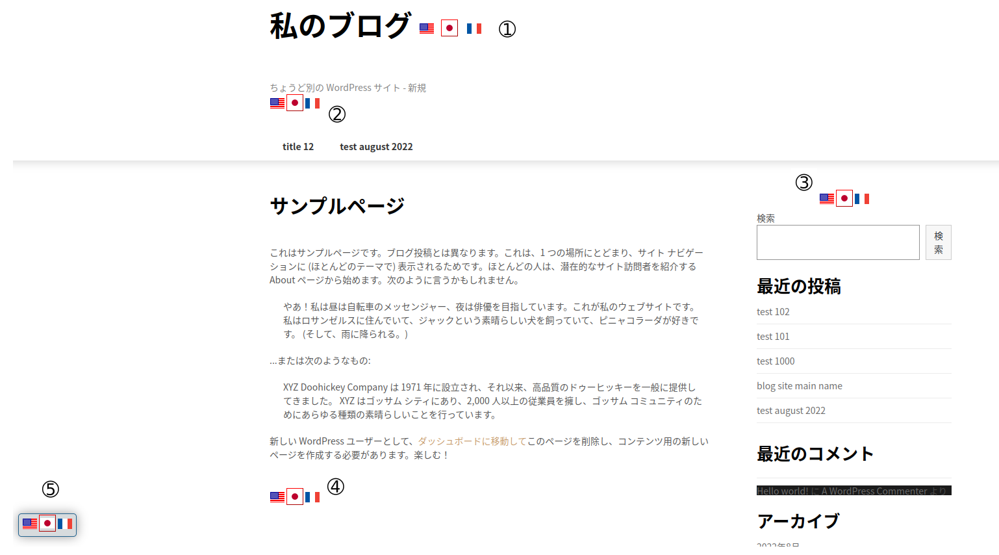
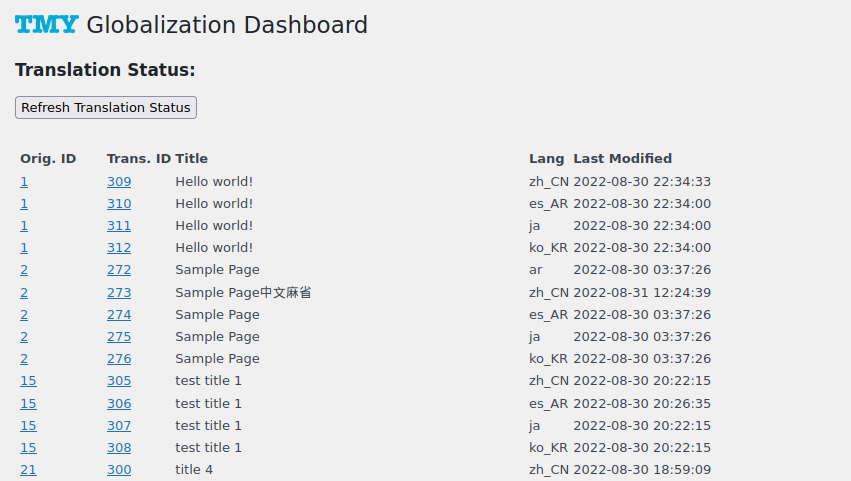
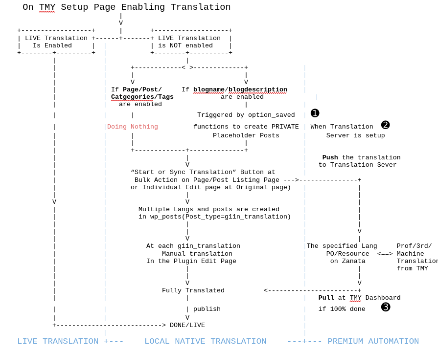

# TMY Globalization Plugin for Wordpress Getting Started & FAQ

----

TMY Globalization Plugin is an open source software for internationalization and localization of Wordpress based websites. TMY Plugin provides two translation workflow. One is **Live Translation** workflow which provides instant translation based on popular machine translation engine. Two, **Full Professional** workflow which involves extracting the text for translation, translating and integrating back into Wordpress. TMY Plugin provides multiple ways to handle different development phases of the Wordpress websites with intuitive and easy to use interfaces.


----

## Install and activate TMY Plugin 

<kbd></kbd>

Download the plugin zip file from https://github.com/tmysoft/tmy-wordpress/releases, e.g. tmy-globalization-1.0.0.zip 

Or, search the "TMY plugin", install and activate it.

## Configure TMY Plugin for Live Translation workflow

From the Wordpress dashboard side menu, Settings -> TMY setup:

<kbd></kbd>

Key configuration:
- Add the extra languages you want to support 
- Make sure the Live Translation powered by Google Translate is set to "Yes"
- Make sure Language Switcher Location is chose at "Draggable Floating Menu"

Press "Save Changes".

Visting your website, switching between languages to see how your website is being translated live.
<kbd></kbd>

## Configure TMY Plugin for Full Professional Translation workflow

From the Wordpress dashboard side menu, Settings -> TMY setup:

<kbd></kbd>

Key configuration:
- Configure the additional enabled languages
- Do you enable translations on key properties: site title, tagline, posts and pages
- Language switcher location
- How do you want your language switcher to look like, just text or showing flags

Remember to save your changes

## Use TMY Plugin to translate a Post or Page

Log into the admin panel of wordpress, navigate to the post page you want to translate, click button 

<kbd></kbd>

Follow the information in the Translation Status box to get to the specific lanaguge translation page:

<kbd></kbd>

Put the translation into the corresponding translation editor of the page or post, then Publish it. Make sure you see the green LIVE button

<kbd></kbd>

## Use TMY Plugin to translate the site title or tagline 

Site title is also called blogname at some places, similarly, tage line is often being called blogdescription, you can configure or change them at Setting -> General menu:

<kbd></kbd>

To start translating them, enable the translation to them from Setting -> TMY Setup:

<kbd></kbd>

Then the plugin will automatically create the place holder post corresponding to the blogname or blogdesription, the place holder post will be set as private. 

<kbd></kbd>

Following the same way to translate the page or post to complete the translation.

## Configure the language swither location 

The language switcher could be placed at multiple places, in Settings -> TMY Setup, you can put it in:

1. In Title
2. In Tagline
3. Top of Sidebar
4. In Each Post
5. Draggable Floating Menu 

Here is the illustration:

<kbd></kbd>

## Using TMY Dashboard

The plugin also provides a dashboard for your convenience to show the translation work in a nice summary:

<kbd></kbd>


## Using TMY Plugin Premium Service

TMY Premium is designed to help users do translation much easily, when the translation server is configured, contents will be pushed to translation server and editor automatically, machine translation automation is also provided for much easier integration. This diagram illustrates the work flow with free vs premium service.

<kbd></kbd>

## Configuration and use TMY Translation Editor(Premium Service)

Register with tmysoft.com, log into the TMY Web Editor/Zanata, create the API key. Create the project and version of your project.

<kbd></kbd>

Enter the username and API Key into TMY Wordpress setup page: username, token, project and version.

<kbd></kbd>

## Pushing translation after Translation Server is configured(Premium Service)

Every time when button  is pressed, corresponding contents will be pushed to translation server.

## Translating with TMY Editor(Premium Service)

Visit `tmysoft.com` then `Editor` or `editor.tmysoft.com` directly.

<kbd></kbd>


## Using Google Translate to translate your post or pages(Premium Service)

Google Translate is fully integrated into tmysoft.com and TMY Web Editor, follow the page at [tmysoft.com/subscriptions.html](https://www.tmysoft.com/subscriptions.html) to start.

## Pulling translation from TMY Editor to your local Wordpress instance(Premium Service)

Visit TMY Dashboard page would automatically pull the finished translation from TMY Web Editor:

<kbd></kbd>

## To start developing TMY Wordpress Plugin

TMY Wordpress plugin is following open source license, look at code here:

[https://github.com/tmysoft/tmy-wordpress](https://github.com/tmysoft/tmy-wordpress)

Ask questions, submit PRs.

## There is no translation after I setup everything 

Make sure translation is enabled in TMY Setup page:

<kbd></kbd>

## TMY Plugin shows connecting error code 7 in Wordpress

On CentOS/Feodra Linux system, the error is mostly due to the SE Linux setting which blocks the network connection, using following command to change the SELinux setting:

```
# setsebool httpd_can_network_connect on
```


## Getting More Support

If you need further support, reach out to us at [tmysoft.com/subscriptions.html](https://www.tmysoft.com/subscriptions.html)
